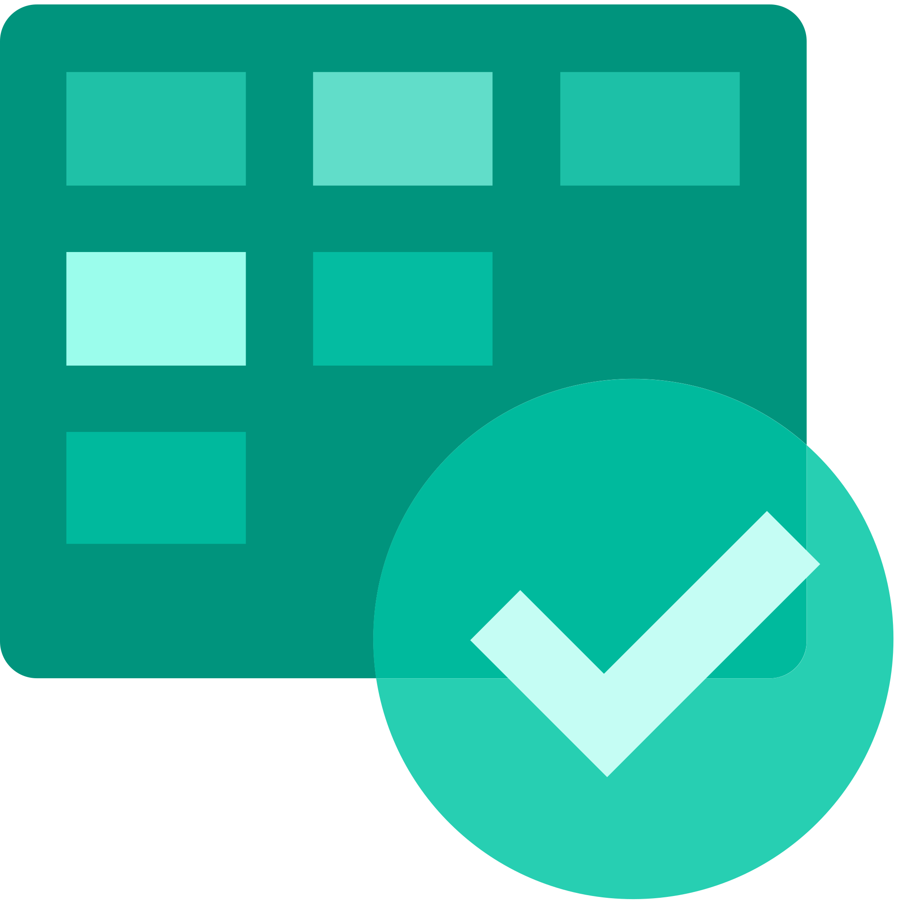

# Hi 👋🏼 I'm Mubin Farid

### Software Engineer • AI Engineering • Cloud & Infrastructure

I'm a Software Engineer working on **backend systems, cloud infrastructure, production engineering, and AI-powered automation**.

Currently at **Systems Limited**, supporting enterprise banking platforms and working with technologies including **Python, Go, Java, AWS, Linux, Kubernetes, Docker, FastAPI, PostgreSQL, observability tools, LLMs, and agent-based systems**.

I enjoy building reliable systems, automating repetitive work, troubleshooting production issues, and exploring the intersection of **AI and infrastructure**.

---

## 🛠️ Tech Stack

### 💻 Languages

  
  
  
  
  
  
  

---

### ⚙️ Backend, AI & Agent Systems

  
  
  
  
  
  
  

**LLMs • RAG • AI Agents • Agent-Based Systems • LangChain • Vector Databases • Prompt Engineering**

---

### ☁️ Cloud & Infrastructure

  
  
  
  
  
  
  
  

**AWS • Azure • EC2 • EKS • IAM • S3 • Linux • Kubernetes • Docker • Helm • Ansible • Terraform**

---

### 📊 DevOps & Observability

  
  
  
  
  
  

**Git • GitHub • Azure DevOps • CI/CD • Grafana • Kibana • Elasticsearch • Logging • Monitoring**

---

### 🗄️ Databases

  
  
  
  

**PostgreSQL • MySQL • MongoDB • SQL Server**

---

### 🤝 Engineering & Collaboration

  
  
  
  

-

**Jira • Azure Boards • ServiceNow • ClickUp • Agile/Scrum • Sprint Planning • Incident Management • Root Cause Analysis**

---

## ⚡ Current Focus

- 🤖 **AIOps & Agent-Based Systems**
- 🧠 **LLMs, RAG & AI Agents**
- ☁️ **AI & Cloud Infrastructure**
- ⚙️ **DevOps / SRE & Production Engineering**
- 📊 **Observability & Distributed Systems**
- 🔧 **Automation & Incident Remediation**
- 🐹 **Go & Python Backend Systems**

---

## 🚀 What I Like Building

- AI-powered production support systems
- Agent-based automation workflows
- Root Cause Analysis & incident management platforms
- Cloud-native backend services
- Kubernetes-based applications
- Observability and monitoring solutions
- AI infrastructure and MLOps tooling

---

## 🔗 Connect With Me

  
  &nbsp;&nbsp;
  
  &nbsp;&nbsp;
  

📍 Karachi, Pakistan  
📧 mubinfarid987@gmail.com

---

## 📊 GitHub Stats

  
  

